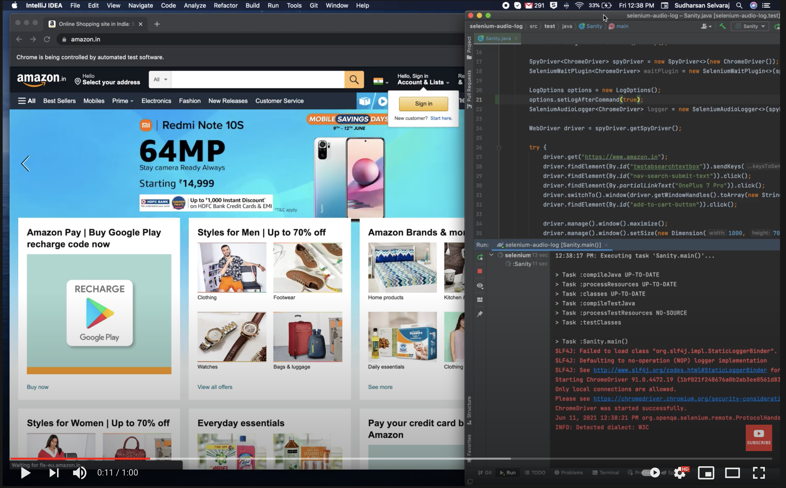

# selenium-audio-logger
👻 👻 Adds a little 🅵🆄🅽 to selenium test execution by speaking out all webdriver/webelement actions performed in the tests

#Demo

[](https://www.youtube.com/watch?v=MFCjuquaOF8 "Selenium piano player")

## Installation

### Maven

```xml
<dependency>
    <groupId>io.github.sudharsan-selvaraj</groupId>
    <artifactId>selenium-audio-logger</artifactId>
    <version>1.0.0</version>
</dependency> 
```

### Gradle

```groovy
implementation group: 'io.github.sudharsan-selvaraj', name: 'selenium-audio-logger', version: '1.0.0'
```

Also while downloading selenium, make sure to exclude `net.bytebuddy:byte-buddy` library by using

### Maven
```xml
<dependency>
   <groupId>org.seleniumhq.selenium</groupId>
   <artifactId>selenium-java</artifactId>
   <version>3.141.59</version>
   <exclusions>
      <exclusion>
         <groupId>net.bytebuddy</groupId>
         <artifactId>byte-buddy</artifactId>
      </exclusion>
   </exclusions>
</dependency>
```

### Gradle
```groovy
implementation (group: 'org.seleniumhq.selenium', name: 'selenium-java', version: '3.141.59') {
   exclude group: 'net.bytebuddy', module: 'byte-buddy'
 }
```

## Quickstart

Initialize the wait plugin using
```java
LogOptions options = new LogOptions();
options.setLogAfterCommand(true);
SeleniumAudioLogger<ChromeDriver> logger = new SeleniumAudioLogger<>(new ChromeDriver(), options);
WebDriver driver = logger.getDriver();
```
That's it. Now the driver object can be used in the test.

## Available options

* `logBeforeCommand` (Boolean) - Whether to log before selenium action is performed. Defaults to `false`
* `logAfterCommand` (Boolean) - Whether to log after selenium action is performed. Defaults to `false`
* `logException` (Boolean) - Whether to log if any exception occurred. Defaults to `true`
* `excludedMethods` (List<String>) - List of methods that will be excluded from logging.
* `voice` (Enum) - Available options `Kevin` and `Kevin16`
* `rate` (float) - Controls the speed of the speech.
* `pitch` (float) - Controls the pitch of the voice.
* `volume` (float) - Controls the volume of the voice.
